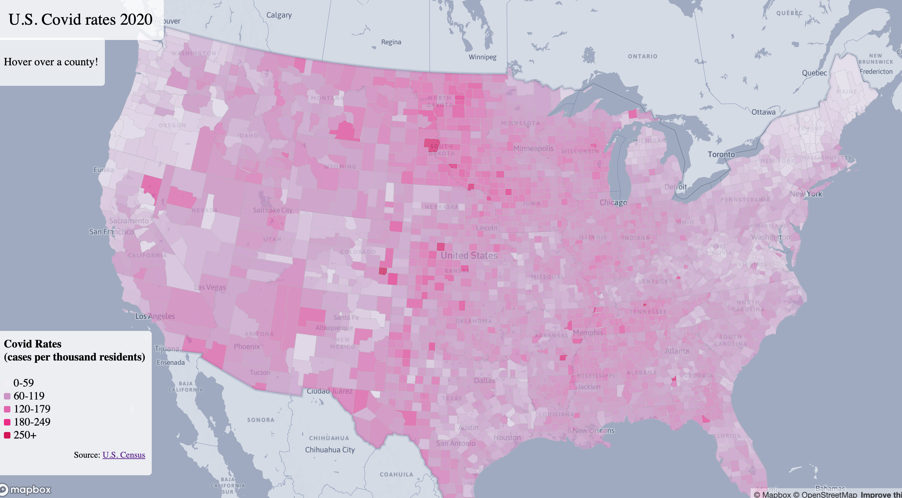
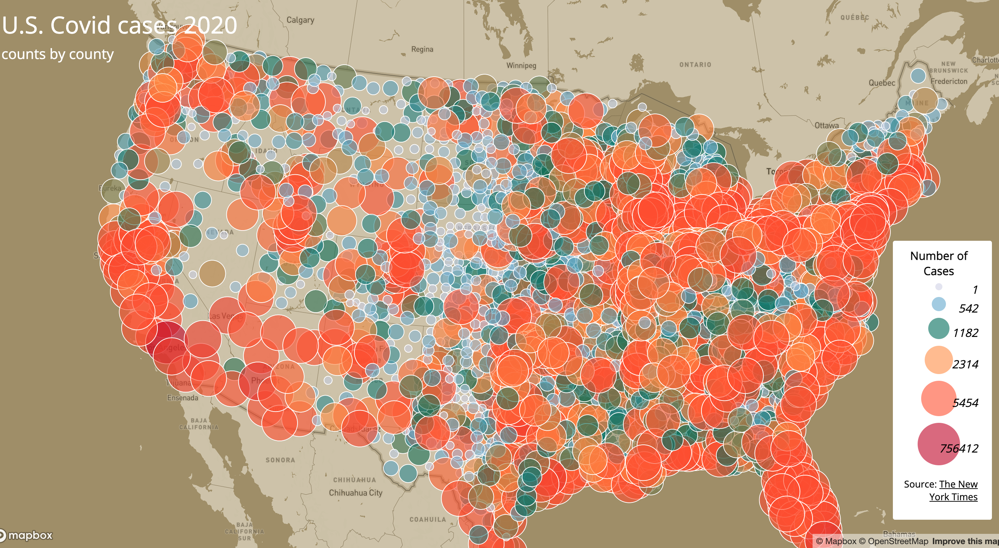

## Web Map Application
### Visualizations of COVID-19 cases and rates in the United States
Introduction:
In this lab, I design two interactive web maps of COVID-19 cases and rates in the United States by county to understand the geographical distribution of COVID-19 cases throughout the U.S. in 2020. 

[Map1]:
A choropleth map of COVID-19 rates. 

[Map2]:
A proportional symbols map of COVID-19 cases.

Libraries and functions:
The primary library that's been used in creating this application is Mapbox GL JS. Some functions that are called to create the interactive functions are map.on('click', ...), mapboxgl.Popup, map.on('mousemove'), map.on('mouseleave), etc. Tools that are used for data cleaning are QGIS and mapshaper. The COVID-19 case/death data are originally from The New York Times, and the population data used for calculating the case rates are from the 2018 ACS 5 year estimates.

Sources: 
- [The New York Times]
- [U.S. Census Bureau]

Acknowledgment:
The data and tutorial of making this web map application were provided by Prof. Zhao. [link to the tutorial]

 [Map1]: https://wendybw.github.io/webmap_application/map1.html
 [Map2]: https://wendybw.github.io/webmap_application/map2.html
 [The New York Times]: https://github.com/nytimes/covid-19-data/blob/43d32dde2f87bd4dafbb7d23f5d9e878124018b8/live/us-counties.csv
 [U.S. Census Bureau]: https://data.census.gov/table/ACSDP5Y2018.DP05?g=0100000US$050000&d=ACS%205-Year%20Estimates%20Data%20Profiles&hidePreview=true 
[link to the tutorial]: https://github.com/jakobzhao/geog458/tree/master/labs/lab03
